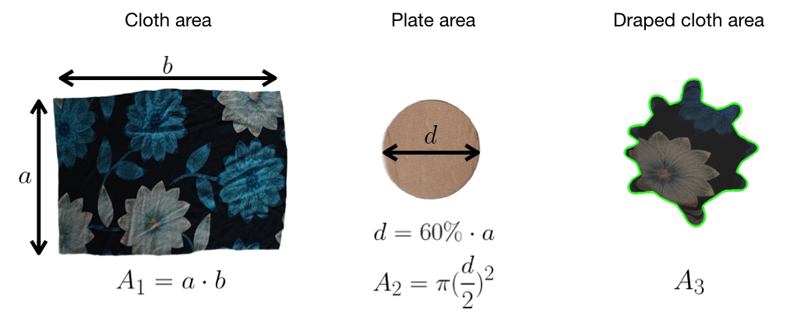

<div align="center">
  <h1 align="center">Standardization of Cloth Objects and its Relevance in Robotic Manipulation</h1>
  <p>
    <a href="http://www.iri.upc.edu/groups/perception/#ClothStandardization">
      
    </a>
    <!-- <a href="https://arxiv.org/abs/2403.04608">
      
    </a> -->
    <a href="https://ieeexplore.ieee.org/document/10610630">
      
    </a>
  </p>
</div>

<p align="center">
 <a href="http://www.iri.upc.edu/groups/perception/#ClothStandardization">
  
 </a>
 <br>
</p>

This repository contains the code for [Standardization of Cloth Objects and its Relevance in Robotic Manipulation](http://www.iri.upc.edu/groups/perception/#ClothStandardization), with the [corresponding paper](https://arxiv.org/abs/2403.04608) accepted at the [2024 IEEE International Conference on Robotics and Automation (ICRA 2024)](https://2024.ieee-icra.org/) in Yokohama. 


Contact: Irene Garcia-Camacho (igarcia@iri.upc.edu)

## Getting Started

The respository includes the necessary packages to measure the stiffness of cloth objects based on the Cusick drape test, adapted to robotic applications, and independently of the camera brand or setup. The package has the following structure:

- **/data** includes the database with zenithal photos of the draped clothes, the resulting images and the stiffness results in CSV files.
- **/src** contains the necessary scripts to compute the stiffness:
    - `stiffness.py` Script to measure the stiffness value of the garment.
      - `trackbars.py` Script to obtain Canny segmentation thresholds. Insert the obtained values in `stiffness.py` script in **t_lower** and **t_upper** parameters.
      - `contour_annotation.py` Script to select the segmentation of the cloth manually. Activate the boolean **manual_segmentation** in `stiffness.py`.
    - `radar_chart.py` Script to create the radar chart. Uses 
    

## Setup

1. Setup a tripod with a zenital RGB camera.
2. If the object to be measured has an edge longer than 50cm or is not rectangular, fold the object in a rectangular shape.
3. Measure the length os the shortest edge (a) of the cloth object.
4. Create a rigid circular plate (either cutting a cardboard or using the 3D design provided in the website) with diameter (d) of a 60% of the measured length (a).
5. Place the circular plate in a vertical structure (or use the 3D printed base) below the zenital camera. 
6. Place the Aruco template on top of the plate and take a zenital image (this serves to obtain the pixel to centimeter ratio).
7. Place the cloth on top of a flat surface (at the same height as the aruco) and take a zenital image of the cloth completely flat (this will serves to obtain area A1). 
8. Place the cloth object on top of the circular plate (at the same height as the aruco) and take a zenital image of the draped cloth (this will serve to obtain area A3).
9. Meaure the stiffnes executing the code following the steps from the next section using the obtained images (aruco, flat and draped cloth).
10. Repeat steps for each cloth object to measure. 

<p align="center">
  
</p>


## Measure the stiffness

1. Follow the previous steps to setup the camera, aruco pattern and cloth objects and take zenithal color images of the aurco pattern, the flat cloth and the draped cloth.
2. Save the images inside the folder "/data".
3. Compute the stiffness of the cloth object through its zenithal image. You will need to introduce the aruco image file (-a), the flat cloth image file (-f), the drapped cloth image file (-i) and the plate diameter used (-p). <!-- and cloth dimensions (-s).-->

```
python3 src/stiffness.py -a <aruco_image> -f <flat_cloth_image> -i <draped_cloth_image> -p <plate_diam>
```
<!-- python3 src/stiffness.py -a <aruco_image> -i <cloth_image> --p <plate_diam> -s <short_edge_length> <long_edge_length> -->

The areas are obtained through Canny segmentation, therefore some samples may require different thresholds to properly segment the draped cloth. In this cases, if necessary, use before the `trackbars.py` script to obtain a better segmentation by sliding the threshold trackbars until the contour of the drapped cloth is correctly detected. Use the obtained values in the `stiffness.py` script as **t_lower** and **t_upper** values. 

```
python3 src/trackbars.py -i EOS/black_flowers_v.jpg
```

For complex cases (such as transparent or patterned materials), you can instead manually select the contour in the images. To do so, activate the boolean manual_segmentation in the `stiffness.py` script.


4. Repeat step 3 for each garment. The resulting stiffness values will be saved on the `stiffness_data.csv` file, along with other useful information.

### Usage example

Example for measuring the stiffness of a cloth object from the Elastic Object Set (EOS) with dimensions 17x23cm, using a plate of 10cm diameter:

```
python3 src/stiffness.py -a Materials/aruco.jpg -f Materials/bata_flat.jpg -i Materials/bata_r.jpg -p 6
```
<!-- python3 src/stiffness.py -a EOS/aruco.jpg -i EOS/black_flowers_v.jpg -p 10 -s 17 23 -->

<!-- ## Terminal output

The previous command will provide the drape ratio percentage (rigidity) through terminal in green, as well as some useful information. -->

## Build your radar chart

Once you have the measures of your cloth set, you can visualize them in a radar chart. To do so, you should have a CSV database with the variance (maximum value - minimum value) of each property of your object sets to compare, with the following structure:

|               | Object set 1                  | Object set 2              | 
| ------------- |:-------------:                |:-------------:            |
| Friction      | `friction_variance_os1`       | `friction_variance_os2`   |
| Construction  | `contruction_variance_os1`    | `contruction_variance_os2`|
| Color         | `color_variance_os1`          | `color_variance_os2`      |
| Size          | `size_variance_os1`           | `size_variance_os2`       |
| Weight        | `weight_variance_os1`         | `weight_variance_os2`     |
| Shape         | `shape_variance_os1`          | `shape_variance_os2`      |
| Material      | `material_variance_os1`       | `material_variance_os2`   |
| Elasticity    | `elasticity_variance_os1`     | `elasticity_variance_os2` |
| Stiffness     | `stiffness_variance_os1`      | `stiffness_variance_os2`  | 


### Usage example

You can obtain the radar chart from Figure 1 of the corresponding article, which compares the Elastic Object Set (EOS), the Household Cloth Object Set (HCOS) and the Dressing Object Set (DOS) running:

```
python3 src/radar_chart.py -i object_sets_data.csv
```

## Dependencies

- Python3
- OpenCV
- CSV
- Pandas

<!-- ## References

[1] C.G.E., "The measurement of fabric drape", Journal of the Textile Institute, vol. 59, pp. 253-260, 1968. -->


## Citation

If you use this code or the measurement framework to characterize your object set, please use the following BibTex entry:

```
@INPROCEEDINGS{garcia-camacho2024standardization,
  author={Garcia-Camacho, Irene and Longhini, Alberta and Welle, Michael and Alenyà, Guillem and Kragic, Danica and Borràs, Júlia},
  booktitle={2024 IEEE International Conference on Robotics and Automation (ICRA)}, 
  title={Standardization of Cloth Objects and its Relevance in Robotic Manipulation}, 
  year={2024},
  volume={},
  number={},
  pages={8298-8304},
  keywords={Benchmarking,Cloth;Manipulation;Standardization;Friction;Elasticity;Stiffness},
  doi={10.1109/ICRA57147.2024.10610630}}
```